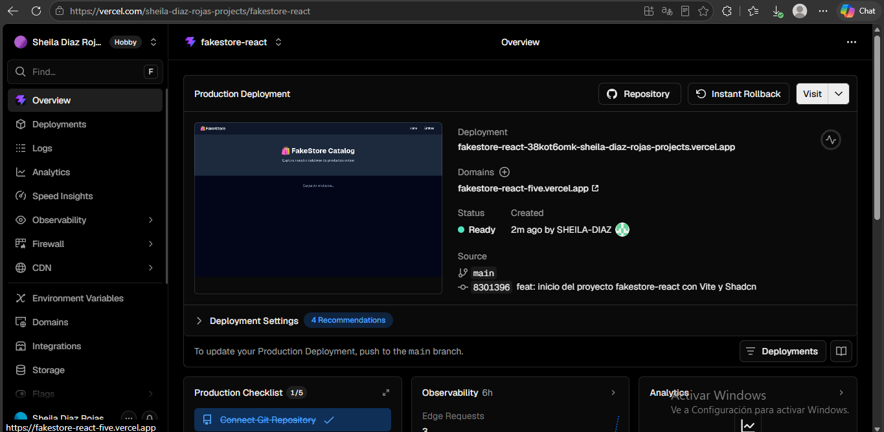
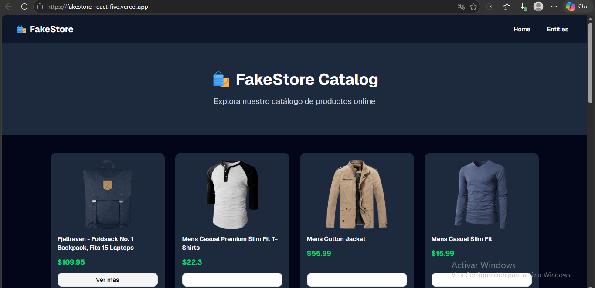

# 🛍️ FakeStore Catalog

Aplicación SPA desarrollada en React que consume la API pública de FakeStore para mostrar un catálogo de productos online.

## 🚀 Tecnologías usadas

- React 19
- Vite
- React Router DOM
- Tailwind CSS v4
- Shadcn/ui

## ⚙️ Pasos para ejecutar el proyecto

```bash
git clone https://github.com/SHEILA-DIAZ/fakestore-react.git
cd fakestore-react
npm install
npm run dev
```

## 📸 Capturas

### 🟣 Vite Default
> Pantalla inicial generada por Vite al crear el proyecto.


### 🏠 Home
> Ruta `/` con hero, descripción y listado de productos consumidos desde la API.


### 📜 Entities
> Ruta `/entities` mostrando tabla con imagen, título, precio y categoría.


### 🚀 Deploy en Vercel
> Dashboard de Vercel con el proyecto desplegado en estado Ready.



### 🌐 App en Producción
> Aplicación funcionando en vivo desde Vercel.



## 🌐 Deploy

[Ver en Vercel](https://fakestore-react-five.vercel.app)

## 🎥 Video

[Ver en YouTube](https://youtu.be/mMYm-tnAU3E)