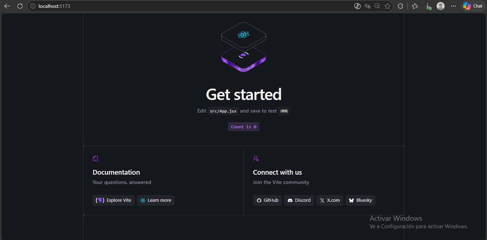
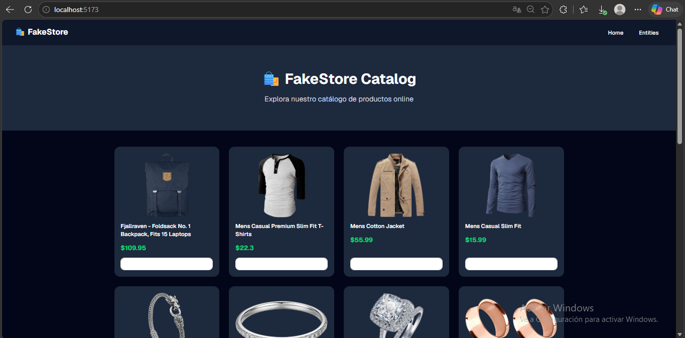
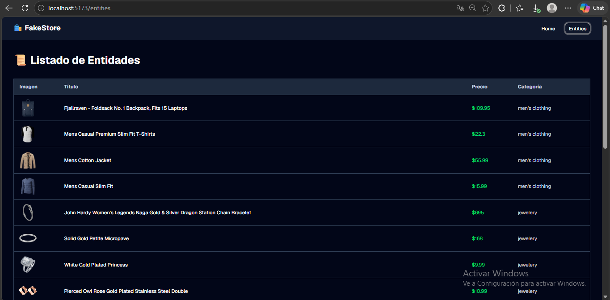

# 🛍️ FakeStore Catalog

Aplicación SPA desarrollada en React que consume la API pública de FakeStore para mostrar un catálogo de productos online.

## 🚀 Tecnologías usadas

- React 19
- Vite
- React Router DOM
- Tailwind CSS v4
- Shadcn/ui

## ⚙️ Pasos para ejecutar el proyecto

```bash
git clone https://github.com/TU_USUARIO/fakestore-react.git
cd fakestore-react
npm install
npm run dev
```

## 📸 Capturas

### Vite Default


### Home


### Entities


## 🌐 Deploy

[Ver en Vercel](TU_ENLACE_AQUI)

## 🎥 Video

[Ver en YouTube](TU_ENLACE_AQUI)